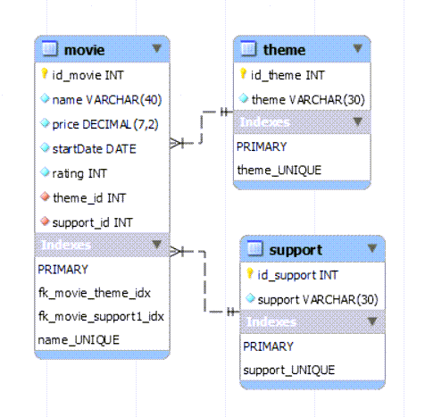
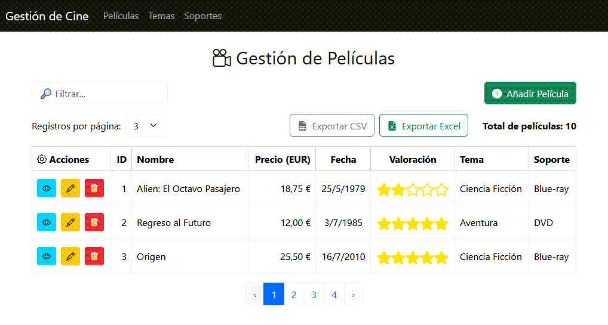
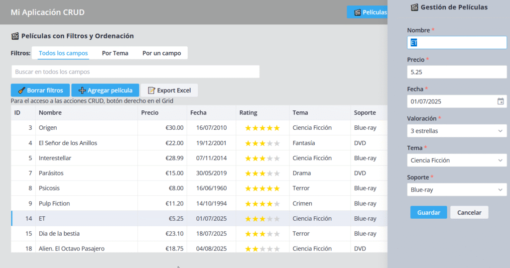
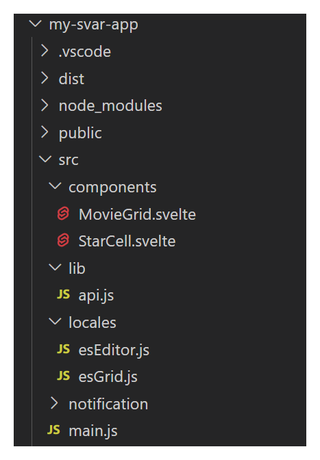
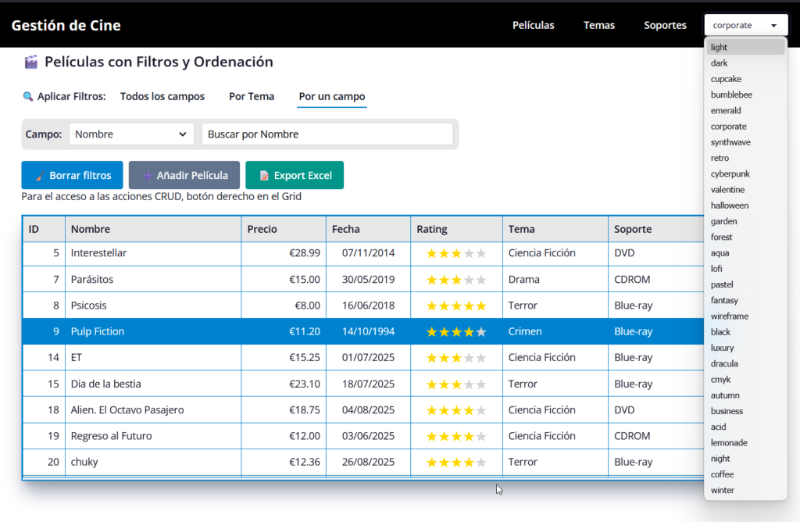

# svelte5-slim4-CRUD-videos

Varios ejemplos de CRUD en Svelt5

Creo que estos ejemplo os va a mostrar lo fácil o difícil, que es 
trabajar en esta plataforma, de acuerdo a vuestros conocimientos.

La funcionalidad es un típico  CRUD de LIST, ADD, EDIT, VIEW y DELETE, de una tabla 
«Videos», con la, también, gestión de las tablas auxiliares de «Temas»
 y «Soportes».



Podéis apreciar que es simple, pero dispone de los elementos habituales, a saber:

- Claves primarias en cada tabla.
- Claves únicas en los nombre para que el propio modelo no admita datos duplicados.
- Claves ajenas o Foreing-key, para que no se pueda eliminar Tema o Soporte, si está en uso en Películas.

Podemos ver que en la aplicación de PHP tiene en cuenta estas  características, para notificarlas (mensaje controlados) al usuario.

## Aplicación del BackEnd en PHP+Slim4

El desarrollo está dividido en 3 directorios:

- "**lib**".- Es el framework de SLIM 4. Se descargó utilizando ***composer***

- "**v1**" .- Es donde está el fichero de inicio del programa "index.php" y el fichero ".htaccess", para que siempre se ejecute el "index.php".

- "**include**" .- Que contiene los ficheros:
  
  - "Config.php" .- Que contiene la parametrización del aplicativo (conexión a la base de datos, claves de Api y título de los mensajes de error).
  
  - "Function.php" .- Son el conjunto de funciones, que no requieren acceso a la base de datos, y que se utilizan el los distintos "entry point".
  
  - "BdMovies.php" .- Son todas las funciones que requieren acceso a la base de datos y se utiliza en los diferentes "entry point".
  
  En mi blog https://fhumanes.com/blog , explico con detalle cómo se escriben estos programas, aunque los de este ejemplo están comentados para que sea más sencillos leerlos.
  
  En los ejemplos de solución de FrontEnd, siempre va a usar este código de Backend. 
  Si dispones de un nivel medio-bajo de PHP, no tendrás problemas en adaptar o crear servidores de Rest Api de esta forma, no obstante, las IA's, indicando el modelo de datos y diciendo que utilizas SLIM4, te va a generar códigos bastantes sencillos de leer y corregir.

### ## Aplicaciones de FrontEnd

Como he explicado, os voy a dejar 4 versiones que tienen la misma funcionalidad, pero distinto interfaz. He utilizado 4 de las soluciones más generales que se utilizan en Svelte5.

Las voy a poner en el orden que las cree, porque entiendo que así veréis que iba aprendiendo según las utilizaba.

### Svelte 5 + Bootstrap 5



**DEMO:** https://fhumanes.com/my-movie-app1

Al venir del "mundo de desarrollo de aplicaciones web" quería ver la funcionalidad de esta plataforma con el estándar de UI de Bootstrap 5.

En este caso, puse esta guía en la instalación:

Para que Bootstrap este disponible para todos los elementos hay que modificar el fichero «Main.js» debe tener este código:

```js
import { mount } from 'svelte'
import 'bootstrap/dist/css/bootstrap.min.css';
import 'bootstrap-icons/font/bootstrap-icons.css';
import * as bootstrap from 'bootstrap';
import './app.css'
import App from './App.svelte';
// Hacer bootstrap disponible globalmente (necesario para el navbar)
window.bootstrap = bootstrap;
const app = mount(App, {
 target: document.getElementById('app'),
})
export default app
```

Y el fichero «jsconfig.json», se debe modificar para que sepa que sólo vamos a trabajar con JavaScript

`.......
    "checkJs": false
........
  "include": ["src/**/*.js", "src/**/*.svelte"]`

Al menos en mi caso, es muy frecuente que mi APP o ejemplo no tenga que 
estar en el directorio raíz de mi Web Server, por eso es necesario 
configurar l fichero «vite.config.js»:

`import { defineConfig } from 'vite'
import { svelte } from '@sveltejs/vite-plugin-svelte'
// https://vite.dev/config/
export default defineConfig({
  plugins: [svelte()],
  base: '/mi-URL/',
  build: {
    outDir: 'dist',
    assetsDir: 'assets',
    assetsInlineLimit: 0 // Asegura que los assets no se conviertan en base64
  }
});`
En la opción «base» se indica la URL del proyecto.

Para **instalar un desarrollo**, es necesario descargarlo en un directorio y después:  
***cd <directorio-app>***  
***npm install***

Para ejecutar el servicio de Web de Test:

***npm run dev***  Lanzar el servidor para testear el desarrollo

***npm run build*** Para construir el aplicativo que se podrá llevar a cualquier servidor de aplicaciones

### Svelte 5 + Svar 2



**DEMO:** https://fhumanes.com/my-svar-app5/

Cuando estás empezando con unos nuevos componentes, tan amplios como los de [SVAR](https://svar.dev/) , puedes estar aprendiendo nuevas cosas más de un mes, y modificando 
cualquier ejercicio que hayas iniciado en ese proceso de aprendizaje.

Este ejemplo es la última modificación que he realizado y **es la solución recomendada**, para que la utilicéis de modelo. Esto no significa que las versiones 
anteriores no sirvan, que yo creo que para aprender , al ser más 
simples, son más sencillas para aprender . Pero esta versión es la mejor si la tabla de datos que estás utilizando tiene algún aspecto de complejidad, además que 
explica funcionalidades de estos componentes.

Este es un ejemplo básico y quiero desarrollarlo mucho más, pero entiendo que puede ser el nivel idóneo para que entendáis el funcionamiento de los componentes de SVAR, paso inicial para que después podáis leer y entender los ejemplos que dispone esta empresa.

«**src/components**».- están los ficheros que tiene programado el CRUD de la tabla «**movies**». El fichero «StarCell.svelte» es el que dibuja las estrellas de la clasificación.

«**src/lib**».- Tiene la clase y configuración para los accesos a «movies-server».

«**src/locales**».- Tiene las traducciones de los textos de los componentes de SVAR que no disponen de una versión en Español.

«**src/notification**».- Tiene el código y los recursos para hacer las notificaciones que se utilizan en la aplicación.

Podréis comprobar que en el GRID de Películas he utilizado código distinto para resolver el «lookup» de Temas y el de Soporte. Esto lo he hecho para que podáis comprobar cómo se puede utilizar ambas formas y las ventajas e inconvenientes que puede tener cada forma de resolver el «lookup».

Creo que los ficheros del directorio «src/components», están llenos de comentarios y pienso que se pueden entender, no obstante si algún aspecto os resulta complejo, por favor, avisadme en mi email e intentaré resolver vuestras dudas.

### Svelte 5 + Tailwind CSS + Daisy UI + Felte + Zod


**DEMO**: https://fhumanes.com/felte-svelte/

Después de múltiples ejemplos, integrar la misma solución que 
integré en PHPRunner (aplicaciones Web), me he cuestionado si estoy 
utilizando Svelte adecuadamente y sobre todo, con los productos más 
habituales que los programadores «nativos» de Svelte, utilizan.

De ahí surgió la utilización de estos productos:

- **Para interface de aplicación, UI**.- He seleccionado [**Tailwind CSS**](https://tailwindcss.com/), que prácticamente es un estándar y que es utilizado masivamente por todos (mucho más que [Bootstrap](https://getbootstrap.com/)) y se complemente con [**Daisy UI**](https://daisyui.com/) que facilita el uso de TailWind CSS y nos dota de Temas, componentes para la iteración con el usuario, etc. Muy, muy importante y excelente solución, que nos soluciona la escritura de los componentes de iteración con el usuario.
- **Para la lógica y validación de los formularios**.- 
  Los productos seleccionados no tienen tanta difusión, pero son un buen 
  ejemplo del ecosistema de soluciones que hay en el entorno de Svelte.  
  [**Felte**](https://felte.dev/), nos soluciona la arquitectura de los formularios y [**Zod**](https://zod.dev/), nos facilta la definición de esquemas de validación de los datos de entrada de los formularios.

Es muy importante seguir las instrucciones de la instalación de  Tailwind CSS y Daisy UI. Ha cambiado mucho su instalación en la última  versión, siendo ahora mucho más sencillo. Cuando le indiqué a [Copilot](https://copilot.microsoft.com/) que quería trabajar con estos 2 productos, me contó «una milonga» de que no estaban migradas a Svelte 5, …., tonterías o «alucinaciones». Cualquier solución que tenga menos de un año, suele «patinar», pero hay que  insistir y vuelve a ayudarte en la integración.

En la página de [Daisy UI](https://daisyui.com/docs/install/) te explica cómo hacer la instalación. En mi caso, trabajo con VITE en Microsoft Visual Studio y este es el resumen de la instalación.

- **Crear proyecto Svelte**
  
  ***npm create vite@latest <nombre-proyecto>***  
  ***cd <nombre-proyecto>***  
  ***npm install***
  
  En el diálogo que aparece al hacer el *create*, indicad que quieres un proyecto de Svelte y que sólo vas a trabajar con JavaScript
  
  Para **instalar un desarrollo**, es necesario descargarlo en un directorio y después:  
  ***cd <directorio-app>***  
  ***npm install***

- **Instalar Tailwind CSS y Daisy UI**
  
  **npm install tailwindcss@latest @tailwindcss/vite@latest daisyui@latest**

- **Añadir Tailwind CSS a Vite Config**
  
  Fichero **vite.config.js**
  
  `import { defineConfig } from 'vite'
  import { svelte } from '@sveltejs/vite-plugin-svelte'
  import tailwindcss from '@tailwindcss/vite'
  
  export default defineConfig({
    plugins: [svelte(), tailwindcss()],
    base: 'tu-proyecto',
    build: {
      outDir: 'dist',
      assetsDir: 'assets',
      assetsInlineLimit: 0 // Asegura que los assets no se conviertan en base64
    }
  });`

- **Configurar los CSS de Tailwind CSS y Daisy U**I
  
  En el fichero **src/app.css** o si lo deseas, **src/style.css**
  
  `@import "tailwindcss";
  @plugin "daisyui" {
      themes:
          corporate --default,
          dark --prefersdark,
          light,
          business,
          cupcake,
          garden,
          synthwave,
          emerald,
          dracula;
  }`

Aquí se define los temas de Daisy UI que están definidos por defecto y además los que puedes usar y cambiar dinámicamente.  
La información de los temas y su configuración lo puedes ver [en este enlace](https://daisyui.com/docs/themes/). Para cambiar dinámicamente de tema tienes que utilizar esta sentencia:

`document.documentElement.setAttribute("data-theme", "emerald");`

### Svelte 5 + SVAR 2 + Tailwind CSS + Daisy UI



**DEMO**: [https://fhumanes.com/movie-svar/](https://fhumanes.com/movie-svar/#/movies)

Este ejercicio era algo que quería emprender hace mucho tiempo. Los componentes de [SVAR](https://svar.dev/), me gustan, me parecen bastantes completos, creo que pueden ser muy 
eficientes para escribir código rápidamente y que también pueden ser muy  útiles para aquellos que empiezan en el desarrollo, porque hay muchas  cosas  que hace por ti y que suelen estar muy bien hechas.

Ahora bien, para mí, tiene una definición de temas que es bastante  «oscuro», ya que no disponen de una documentación sencilla y completa,  para que podamos ajustar estos temas a nuestra necesidades o gustos.

Al haber terminado el ejemplo de [Tailwind CSS](https://tailwindcss.com/) y [Daisy UI](https://daisyui.com/), ver la facilidad que ofrecen a los desarrolladores para los ajustes de  UI de las aplicaciones, pensé que una solución de ese tipo, es lo que requerían los componentes de SVAR.

La integración ha quedado un poco artificial. Se la he pasado al equipo de SVAR, por si consideran que pudiera ser de utilidad y que hagan el trabajo de integración.

(1) **themes/daisy-example.css** .- En este fichero lo único que muestra son las propiedades de CSS que varían cuando se cambian los temas de Daisy UI. No interviene en la ejecución de la aplicación.

(2) **theme/Willow-custom.css** .- Son las propiedades de CSS que cambian en los cambios de temas  de SVAR. En él se pueden establecer las correspondencias entre las 
propiedades de Daisy y SVAR, para que cuando cambie el tema de Daisy se 
ajuste el tema de SVAR.

(3) **themes/custom-theme.css** .- Es el fichero de personalización del tema de SVAR para esta aplicación. Se podría haber actualizado el fichero (2) con parte de este
 fichero, pero creo que es más interesante disponer de 2 ficheros con  personalización General (2) y Específica (3).

(4) **theme/ThemeSelector.svelte** .- Es el código que se utiliza para el cambio de tema de Daisy. Es sencillo de leer, un selector o combo de todos los tema y el código que
 produce el cambio:

`document.documentElement.setAttribute("data-theme", selected);`

(5) **app.css** .- El fichero de integración de Tailwind y Daisy UI, con el conjunto de Temas que se pueden utilizar en la aplicación.

(6)  **App.svelte** .- El inicio de la aplicación con la configuración de la carga de 
los ficheros CSS.  Si observáis, el fichero (3), su contenido está en el apartado de «<styles global>». Cuando desarrollo, lo tengo que tener ahí para que los cambios se vean actualizado en la ventana de Test del desarrollo. Esto no es necesario en producción y puede habilitarse la línea 48.

`@import "./themes/custom-theme.css"; /* Importa tu tema personalizado */`

Es muy probable que surjan nuevo problemas como el que ha surgido en 
el tratamiento de los «Tooltip». En este caso, parece que ambas 
plataformas (Svar y Daisy), configuran la misma clase y tal como está 
hecha la integración la configuración de SVAR se mantiene sobre la de 
Daisy UI y por ello, cada vez que se utilice «Tooltip de Daisy» se tiene
 que incluir esta definición de CSS.

`/* Normalización de estilos para SVAR y DaisyUI */`

`/* Para normalizar el Tooltip de Daisy, porque lo rompe SVAR */`

`.tooltip[data-tip] {`

`position: relative !important;`

`pointer-events: auto !important;`

`background-color: transparent !important;`

`box-shadow: none !important;`

`padding: 0 !important;`

`z-index: 4 !important;`

`}`

Aunque soy consciente que el ejercicio no está completamente así, como explico a continuación, mi intención es trabajar en esta propuesta:

- Para todo lo que tenga que ver con Datra Grid, Filtros,   Formularios, etc, utilizar los componentes de SVAR.
- Para todo lo que  no se utilice SVAR, utilizar los componentes de Daisy UI (estos componentes se ven más modernos).
